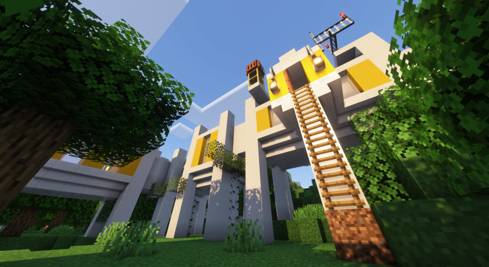
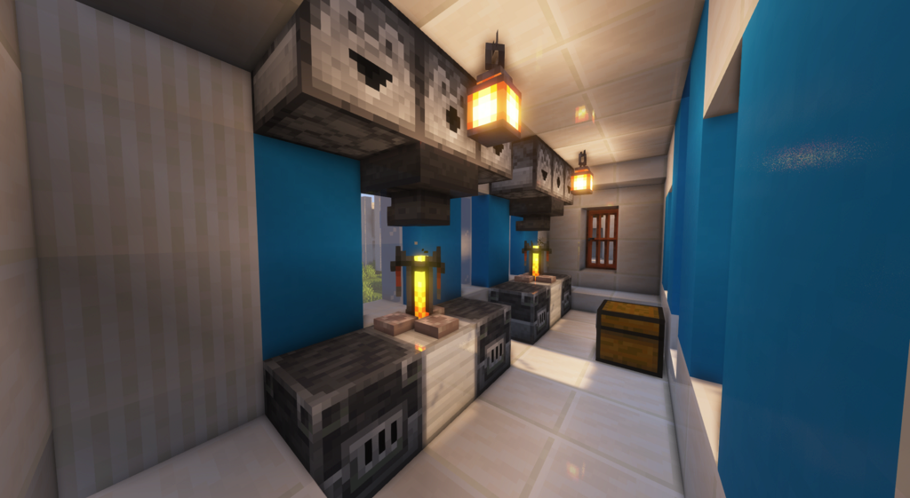
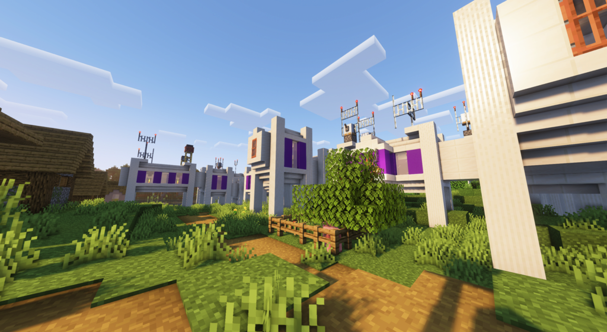
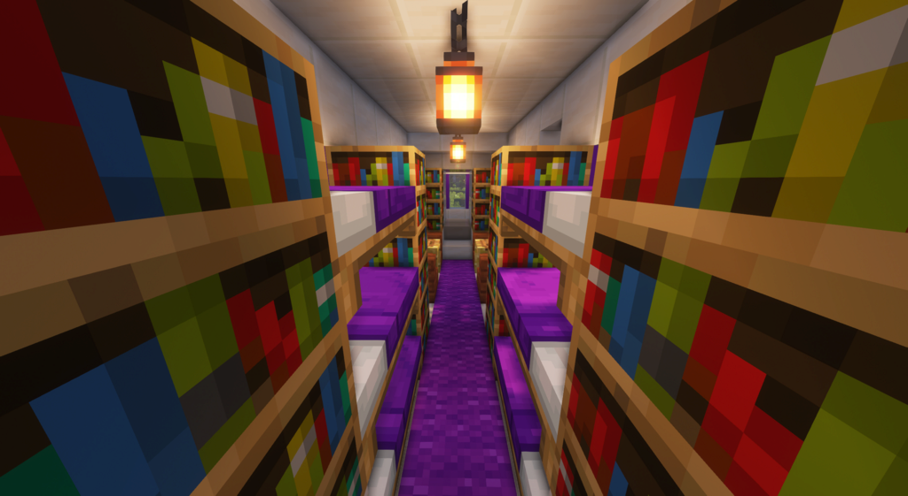

# GDMC 2022
Submission by Niels-NTG for the [2022 AI Settlement Generation Challenge](https://gendesignmc.engineering.nyu.edu/).

In this competition participants design and implement an algorithm that constructs a settlement in Minecraft. Submissions are judged on the aesthetics and narrative qualities of the output, on how functional the structure is from a gameplay perspective, and how well it adapts to any arbitrary Minecraft landscape.

## Field Lab Beta β
Field Lab Beta is a mysterious scientific research station that suddenly just appeared into the world. Where did it come from? Who were the staff? What were they looking for and where have they gone to?

### Setup
This script works combined with the [HTTP Interface Forge mod](https://github.com/nilsgawlik/gdmc_http_interface) for Minecraft 1.16.5. The generator itself is written for Python 3.9 and requires the packages listed in `requirements.txt`. Start the generator by running `main.py`, no CLI arguments required. By default the structures will be placed somewhere within default build area sized 128x128 at the world's zero x-z coordinates. This can be changed by setting the buidarea by running `/setbuiltarea fromX fromY fromZ toX toY toZ` in Minecraft itself before running the generator.

### Methods
The generator is built around the generator of nodes, which are not unlike the Jigsaw technique Minecraft itself uses to generate settlements such as villages. Each node contains a prefab structure contained in an NBT file + JSON file with additional information, such as what the connection points to attach other nodes, applying post-processing steps, amongst other things. Before doing any placement, the generator evaluates if the placement is possible (no terrain in the way, not exceeding built area) and also calculates a building cost for each possibility to act as an inverse probability for picking the next node.
